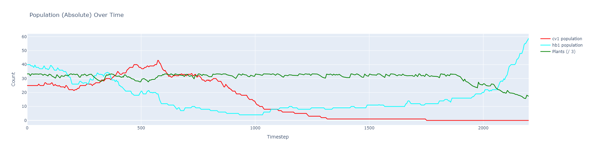
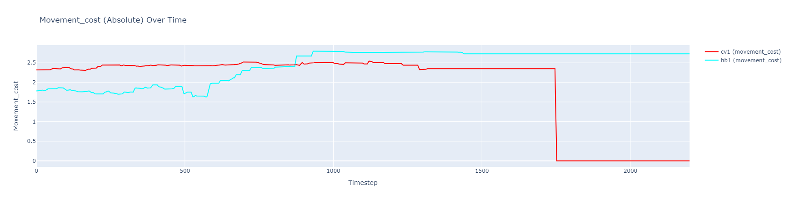
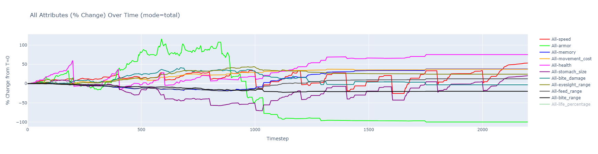
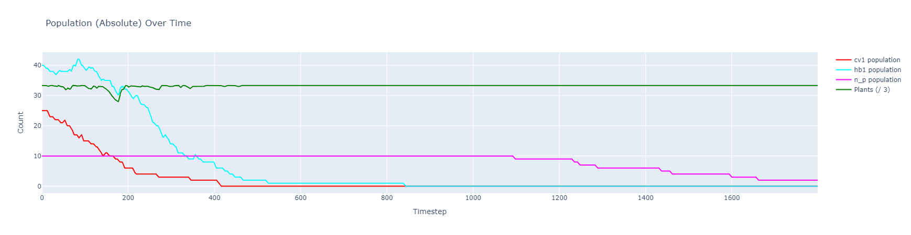
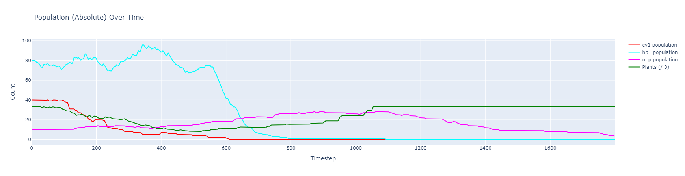
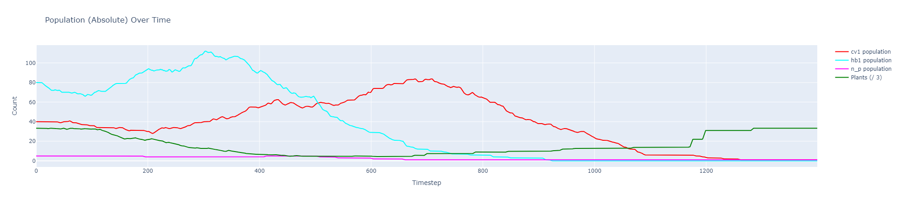
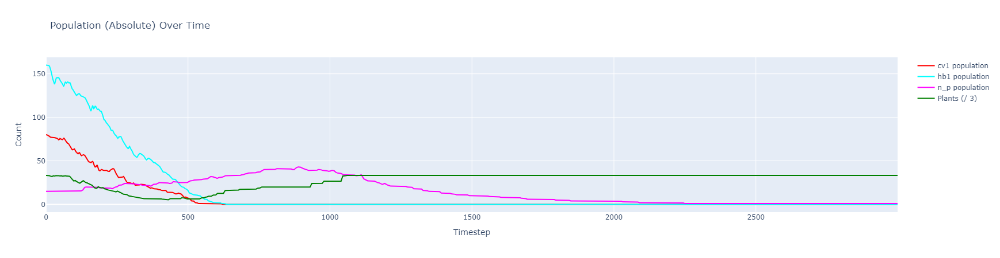
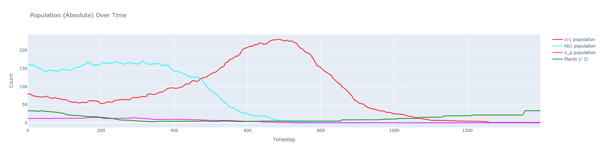
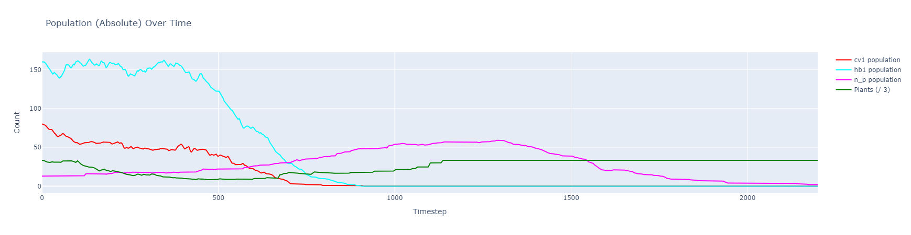
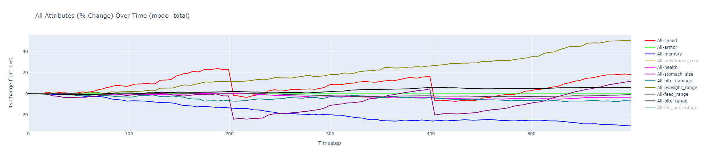

# **Part 1: Model description**

## **1. Introduction**

Our simulation aims to model an **agent-based aquatic ecosystem** in which multiple fish species (herbivores, carnivores, omnivores) attempt to coexist. The overarching goal is to see how predator–prey interactions emerge, especially when an invasive is introduced into the ecosystem.

Unlike purely mathematical models (e.g., simple Lotka-Volterra equations), this agent-based approach lets each fish act on local decisions, memory, or other factors.

---

## **2. Agent Types & Roles**

1. **Herbivores**
   - Survive by eating plants that spawn/spread around the map.
   - Fully rely on the availability of plants.
2. **Carnivores**
   - Attack and eat other fish for food instead of plants.
   - Ususally higher movement cost to have statistics fit for catching prey
3. **Omnivores**
   - Can survive on both plants and weaker fish.
   - They present an interesting dynamic: they can act like herbivores if carnivore prey is scarce, or like carnivores if plants get scarce. This can keep them quite adaptable but also potentially disruptive.
4. **Invasive Species**
   - A specialized fish type (often also carnivorous or omnivorous) introduced into a previously balanced ecosystem.
   - The question is how their arrival impacts the balance among other species: do they wipe out existing species, do they settle into equilibrium, or do they die off?

---

## **3. Agent Stats (Genome)**

Each agent has a **genome** that defines its numeric attributes. These attributes are typically chosen from min/max ranges at creation:

- **speed** - Movement per timestep. Faster fish can chase prey or escape predators more easily but pay a higher movement cost.
- **health** - Maximum health. A fish with high health resists starvation or damage longer. Health is typically in the hundreds, so we keep its movement cost factor quite small.
- **stomach_size** - How much food the fish can store internally. A bigger stomach reduces starvation chances but mildly increases movement costs.
- **armor** - Reduces incoming damage from an attack. High armor helps carnivores remain dominant or herbivores survive attacks. It’s also moderate in cost.
- **bite_damage** - How hard the fish can bite. High bite damage leads to more lethal attacks, but that also increases movement cost.
- **eyesight_range** - How far the fish can detect potential prey, predators, or plants. Larger range is helpful but has a small cost.
- **feed_range** - The distance within which a herbivore can “eat” plants. Typically small, requiring the fish to be close.
- **bite_range** - The distance at which a carnivore or omnivore can successfully land a bite on another fish.
- **memory** - Number of steps an agent can remember a target (food or predator) after losing direct line-of-sight. A bigger memory can help chase prey or recall threats but adds minimal movement cost.
- **depth_point** and **depth_tolerance_range** - Where a fish _prefers_ to live (e.g., 20 m below surface) and how flexible it is about going deeper or shallower. Going outside that range leads to depth damage.
- **lifespan** and **egg_lifespan_required** - The fish’s overall maximum life expectancy (randomly drawn around some mean) and how long (or what fraction of lifespan) it must live before breeding is allowed. Agents die of old age once `life > lifespan`.

---

## **4. The Environment & Core Parameters**

1. **Map**
   - Defined by `mapsize`, e.g. 128×128 or1200×1200 for a large aquatic area, this parameter creates a square map. There is technically no limit to this.
   - A depth map loaded from an image (grayscale). The environment normalizes pixel intensities to represent deeper or shallower regions.
   - `min_depth` and `max_depth` define the overall depth range of the entire environment.
2. **Food (Plants)**
   - A certain **`starting_plant_population`** seeds the map. Plants **grow** at a rate `plant_growth_speed` per timestep and can **spread** new seeds at intervals of `plant_spread_interval` if they’ve reached `plant_minimum_growth_percentage`.
   - Each spread event adds up to `plant_spread_amount` new plants around the parent in a radius `plant_spread_radius`.
   - A **global** limit `max_plants_global` caps how many plants can exist, preventing explosive growth to simulate
3. **Agents**
   - We can define one or more species with custom parameter ranges. E.g., `hb1` for herbivores, `cv1` for carnivores, an invasive species, etc.
   - `starting_population` indicates how many fish spawn initially (or we define population in each species dictionary).
   - `movement_cost_factor` multiplies an agent’s negative movement cost each time it moves, so faster or more heavily “equipped” fish pay more.
   - `mutation_factor` controls random variation when two fish breed, so offspring can differ slightly.
4. **Time & Execution**
   - The simulation runs up to `max_timesteps` or until all fish die. Each step:
     1. Agents sense surroundings (RayCast, etc.).
     2. Agents move/eat/attack/breed.
     3. Plants grow or spread.
     4. Depth damage is applied if fish stray too far from `depth_point`.
     5. Vitals are checked to see if the fish is supposed to die.
   - We can optionally **render** the environment in a PyGame window (human mode), or run it without visualization for somewhat better speed.

---

## **5. Simulation Mechanics**

1. **Movement & Movement Cost**
   - Each step, a fish decides on an action (chase prey, find plants, run from predators, or patrol).
   - That movement adds a negative cost to its internal food store. Speed is key but drains resources faster if the agent invests heavily in it.
2. **Feeding**
   - **Herbivores** check if plants are within `feed_range`. If yes, they gain energy proportional to plant growth percentage.
   - **Carnivores/Omnivores** search for agent targets within `bite_range`. If they succeed, they deal damage and gain food.
   - Omnivores can also switch to plant-eating if no prey is in sight.
3. **Depth**
   - Agents live within `[depth_min, depth_max]` from their genome. If they exceed it (like going below `depth_min` or above the seabed), they take incremental damage each step.
4. **Breeding**
   - For breeding, an agent typically needs:
     - Enough time lived (`egg_permitted >= egg_lifespan_required * lifespan`),
     - Enough stored food (≥ 50% of stomach),
     - A mate of the same `type` (herbivore or carnivore or omnivore).
   - The child inherits a blended set of stats with random mutation.
5. **Death & Logging**
   - Agents die from:
     1. Starvation (food ≤ 0),
     2. Health ≤ 0 (injuries, repeated attacks),
     3. Old Age (life exceeds random `lifespan`).
   - The environment logs the cause of death and the timestep, letting us analyze later who died of hunger vs. old age vs. predator attacks.
6. **Invasive Species**
   - Introduced as a separate species with possibly higher speed or bigger `bite_damage`, or even omnivorous feeding.
   - We watch how they spread or dominate existing species if they adapt better to available resources or outcompete local fish.

---

## **6. Quick Reference: Key Parameters**

| **Parameter**            | **Description**                                                        | **Typical Range**                           |
| ------------------------------ | ---------------------------------------------------------------------------- | ------------------------------------------------- |
| **mapsize**              | Dimension of the square map in cells (width = height)                        | 100-2000                                          |
| **min_depth, max_depth** | Global min/max for water depth in this environment                           | 10–70                                            |
| **starting_population**  | Base # of agents (or defined per species)                                    | 10–200 each (heavily resource dependent)         |
| **food_value**           | Energy a fully grown plant provides                                          | 5-1000                                            |
| **movement_cost_factor** | Multiplies agent’s negative movement cost per step                          | 0.01–0.5                                         |
| **max_plants_global**    | Overall plant cap; no new plants spawn above this count                      | 50–1000+                                         |
| **plant_spread_amount**  | How many new plants spawn per spread event                                   | 2–10                                             |
| **plant_spread_radius**  | Max radius around the plant’s position for new spawns                       | 100–800+                                         |
| **mutation_factor**      | Strength of random variation in offspring stats                              | 0.01–2.0                                         |
| **species**              | Dictionary of species definitions (herbivore, carnivore, omnivore, invasive) | Custom species with genomes and requested visuals |

---

## **7. Conclusion**

With these definitions, our ecosystem can exhibit a range of outcomes: predator–prey cycles, chaotic booms and crashes, or near extinction if an **invasive** fish outperforms local species. By adjusting **parameters** (e.g., `speed`, `armor`, `plant_spread_amount`), we can explore scenarios like:

- **Two species coexisting** vs. one out-competing the other,
- **Lotka-Volterra–style** population oscillations,
- **Invasive species** introduction leading to disruption or total takeover.

The next sections will delve deeper into how we built, tested, and analyzed these interactions.

---

---

# **Part 2: Description of works**

We developed this simulation by **adapting** an existing **Multi-Agent Reinforcement Learning (MARL) ecosystem** (built with PettingZoo) into a **pure agent-based** simulation. Instead of learning policies, each fish now follows simple decision rules for movement, feeding, breeding, and so forth.

One of our major tasks was restructuring the environment to directly run agent logic each step: rather than agents learning from rewards, they behave according to species-defined stats (speed, bite range, memory, etc.) and very complex agent algorithms, which require tons of calculations. Because we also introduced multiple species (herbivores, carnivores, omnivores, and an invasive type) on a large agent population the code became performance-heavy . Each timestep, we run line-of-sight checks and update plant growth across potentially thousands of cells—scaling up quickly with bigger maps and populations.

Despite these overheads, the final simulation can handle: 

1. A large or very detailed map (e.g., 3000×3000),
2. Complex interactions among many agents,
3. Plant growth/spreading (with performance driven limit),
4. Depth constraints ensuring fish remain in valid water depths.

Overall, our focus was ensuring realistic agent-based dynamics—where each fish has intuitive actions—while wrestling with the cost of repeated distance calculations and update loops. The outcome is a flexible simulation platform for exploring how an ecosystem with multiple feeding strategies, including an invasive species, might unfold.

The biggest issue lies in validation with real world data - there are not many papers describing the simulated question in numbers. We based our simulation on the introduction of Nile Perch into Lake Victoria, and the simulation does make use of Lake Victoria's seabed. There are no papers that accurately describe the populations or actual properties of fish in question, the problem is also incredibly complex so this simulation is considerably simplified compared to the real events that occured. The papers also focused much more on the impact of the event on the local human population instead of specifying how the dynamics of the introduction of Nile Perch worked. This sadly means that our code cannot be validated against any papers and should be treated as more of a simulation of what impacts would changes have instead of a direct reconstruction of events.

---

---

# Part 3: Analysis of the results

## 1. Can the model reproduce a Lotka-Volterra model of predator-prey dynamics? Is it possible for two species to co-exist?

The Lotka-Volterra equations describe the predator-prey dynamics in a balanced ecosystem and are the basis of simulating competitive ecosystems. A good model should be able to somewhat replicate the behavior presented in models based on the equations - when the amount of predators rise, the amount of prey decreases. When the amount of prey decreases, the amount of predators rise and the cycle continues.

The biggest problem when we tried to find out the answers to this question was snowballing - one species would gain dominance and lead to extinction of another. This is realistic to a point, because total extinction is usually prevented due to nuanced mechanics of the real world - hiding spots, specific tactics and millions of other species taking the place of the ones that die out. Finding an equilibrium that creates a perfect cycle was extremely hard and was not accomplished. Nevertheless, the best result was chosen and presented here:

The population analysis for this case presents the dynamics in how the population of carnivores (cv1 species) and herbivores (hb1) as well as plants changed over time in relation to each other. We can see that initially the carnivores started with population of 15 and due to an abundance of prey, their population grew. As it did however, the amount of food (prey) decreased, which led to a reduction (and eventual extinction) of the carnivore population. Herbivores initially started strong but were thwarted by the amount of predators. When the danger decreased due to mass deaths amongst the predators, the few remaining herbivores could rebuild their population and it began to skyrocket. This is also observed in the number of plants, which started to steadily decrease.

We have observed that with low amounts of plants, another extinction could follow with very few remaining survivors able to rebuild the population again (this is explored in another question).

Let's look at the evolutionary aspect represented by movement cost, which increases with the strengths of the agent:

We can observe a significant increase in the movement cost amongst the herbivores, but rather a stabilization amongst the carnivores. One species tried to make itself stronger agaisnt oponnents, while another tried to balance its strenghts against hunger, which was their main source of deaths.

Evolution of the attributes point out to interesting things when compared with the population graph - while armor was needed, it was increased, but then rapidly decreased - around the time where predators died out, then it became useless and was reduced - higher cost of movement was offset by ability to shrug off attacks, but now it just meant useless weight that could be removed to improve efficiency. Other than that, we can see a general increase in most attributes over time.

**Answer: The model in theory can reproduce a Lotka-Volterra based model, but finding the right balance is really tricky. As in nature, two species can coexist, but require very specific conditions to fulfill.**

Evaluation of the model in regards to this question:

| **Aspect**       | **Question for this scenario**                                    | **Answer and comments**                                     |
| ---------------------- | ----------------------------------------------------------------------- | ----------------------------------------------------------------- |
| **Validation**   |                                                                         |                                                                   |
| Real-world accuracy    | Does the model represent the real-world system it is simulating?        | Partially, a lot of nuance is missing, which leads to snowballing |
| Behavioral realism     | Do the agents' behaviors align with what is observed in the real world? | Yes                                                               |
| Emergent patterns      | Do the emergent patterns match those seen in the real system?           | Yes                                                               |
| Robustness             | Does the model behave realistically under a range of input conditions?  | Yes                                                               |
| Sensitivity            | Are the model’s outputs sensitive to important parameters as expected? | Yes                                                               |
| **Verification** |                                                                         |                                                                   |
| Implementation         | Is the code free of bugs and errors?                                    | Yes                                                               |
| Rule consistency       | Do agents follow the rules as defined in the model design?              | Yes                                                               |
| Correctness            | Are algorithms and equations implemented as intended?                   | Yes                                                               |
| Logical flow           | Do interactions between agents occur as designed?                       | Yes                                                               |

## 2. How does an introduction of an invasive species affect the ecosystem?

In order to answer this question, the previous question had to establish some sort of a baseline, an ecosystem against which we could compare the invasive species introduction.

At first a population of 10 agents of an invasive species, which were modeled after Nile Perch (large, fast carnivorous fish with high intelligence and view range) were introduced to the ecosystem to observe their behavior. The population graph was as follows:

Even though the Nile Perch were few in numbers, they extremely quickly managed to eliminate first the carnivores and then herbivores, only to die from lack of food later on. To combat this, we tried much larger initial populations of two base species:

In this case, the Nile Perch still caused absolute domination, grew in numbers and caused an extinction of the ecosystem.

**Answer: Introduction of an invasive species into an ecosystem can cause a total collapse of the entire food chain and lead to a complete extinction in extreme cases.**

Evaluation of the model in regards to this question:

| **Aspect**       | **Question for this scenario**                                    | **Answer and comments**                                                                                          |
| ---------------------- | ----------------------------------------------------------------------- | ---------------------------------------------------------------------------------------------------------------------- |
| **Validation**   |                                                                         |                                                                                                                        |
| Real-world accuracy    | Does the model represent the real-world system it is simulating?        | Partially, as the same issue persists - lack of details that allow for some specimen to survive a violent new predator |
| Behavioral realism     | Do the agents' behaviors align with what is observed in the real world? | Yes                                                                                                                    |
| Emergent patterns      | Do the emergent patterns match those seen in the real system?           | Yes                                                                                                                    |
| Robustness             | Does the model behave realistically under a range of input conditions?  | Yes                                                                                                                    |
| Sensitivity            | Are the model’s outputs sensitive to important parameters as expected? | Yes                                                                                                                    |
| **Verification** |                                                                         |                                                                                                                        |
| Implementation         | Is the code free of bugs and errors?                                    | Yes                                                                                                                    |
| Rule consistency       | Do agents follow the rules as defined in the model design?              | Yes                                                                                                                    |
| Correctness            | Are algorithms and equations implemented as intended?                   | Yes                                                                                                                    |
| Logical flow           | Do interactions between agents occur as designed?                       | Yes                                                                                                                    |

## 3. Is there an optimal population amount for an invasive species to introduce in order for it not to take over the ecosystem?

To find out if there is an initial invasive species population that doesn't lead to a total collapse, we tried the tests once again on the scaled up populations.

The first test results are for an initial population of 5 Nile Perch agents:

The initial population did not have much of an impact on the entire ecosystem, but at the cost of the Nile Perch population itself - the low amount of fish caused a slow extinction due to never meeting a mate that would allow it to survive. To test if it would be possible for it to survive, we once again scaled up the populations. Having a population of 10 Nile Perches provided similar results, so we went up to 15 agents:

The Nile Perch was able to find mates and breed, causing total extinction once again. We tried it with 12 initial agents:

Once again, the population was unable to sruvive and thrive in the environment although it did not change the environment in any significant way.

13 Nile Perches is however enough to destabilize the environment and cause a total collapse.

**Answer: Invasive species are named as such for a very good reason and their introduction will always lead to 2 possible outcomes - their extinction or domination over the environment. Their introduction should be very thought out and studied before making a decision.**

Evaluation of the model in regards to this question:

| **Aspect**       | **Question for this scenario**                                    | **Answer and comments**                                                                                                 |
| ---------------------- | ----------------------------------------------------------------------- | ----------------------------------------------------------------------------------------------------------------------------- |
| **Validation**   |                                                                         |                                                                                                                               |
| Real-world accuracy    | Does the model represent the real-world system it is simulating?        | Lack of precise data on the introducion of invasive species prevents actual representation, but it models the issue properly. |
| Behavioral realism     | Do the agents' behaviors align with what is observed in the real world? | Yes                                                                                                                           |
| Emergent patterns      | Do the emergent patterns match those seen in the real system?           | Yes                                                                                                                           |
| Robustness             | Does the model behave realistically under a range of input conditions?  | Yes                                                                                                                           |
| Sensitivity            | Are the model’s outputs sensitive to important parameters as expected? | Yes                                                                                                                           |
| **Verification** |                                                                         |                                                                                                                               |
| Implementation         | Is the code free of bugs and errors?                                    | Yes                                                                                                                           |
| Rule consistency       | Do agents follow the rules as defined in the model design?              | Yes                                                                                                                           |
| Correctness            | Are algorithms and equations implemented as intended?                   | Yes                                                                                                                           |
| Logical flow           | Do interactions between agents occur as designed?                       | Yes                                                                                                                           |

## 4. How do specific parameters evolve over time if there is just one herbivore species?

We have run the simulation on adjusted parameters for some time, which sadly was limited by our machines' performance, but it gave some insight on what genes are passed down to optimize next fish generations:

**Answer: We can certainly observe that most important parameter was eyesight range, while the next one was speed, which did however have a few dips when the previous old generations moved on to newer ones, then the speed always picked back up. Interestingly enough, memory went rather down - in a simple environment, it is a good idea to conserve resources and so, it was discarded in favor of more benefitial attributes. This proves that evolution will try to optimize the organisms to pick out more benefitial attributes and reduce the ones for which the cost isn't worth the return.**

Evaluation of the model in regards to this question:

| **Aspect**       | **Question for this scenario**                                    | **Answer and comments**                                          |
| ---------------------- | ----------------------------------------------------------------------- | ---------------------------------------------------------------------- |
| **Validation**   |                                                                         |                                                                        |
| Real-world accuracy    | Does the model represent the real-world system it is simulating?        | In general                                                             |
| Behavioral realism     | Do the agents' behaviors align with what is observed in the real world? | Yes                                                                    |
| Emergent patterns      | Do the emergent patterns match those seen in the real system?           | Yes                                                                    |
| Robustness             | Does the model behave realistically under a range of input conditions?  | Yes                                                                    |
| Sensitivity            | Are the model’s outputs sensitive to important parameters as expected? | Yes                                                                    |
| **Verification** |                                                                         |                                                                        |
| Implementation         | Is the code free of bugs and errors?                                    | Some anomalies were detected connected to uncontested spread of agents |
| Rule consistency       | Do agents follow the rules as defined in the model design?              | Yes                                                                    |
| Correctness            | Are algorithms and equations implemented as intended?                   | Yes                                                                    |
| Logical flow           | Do interactions between agents occur as designed?                       | Some anomalies were detected connected to uncontested spread of agents |

---
